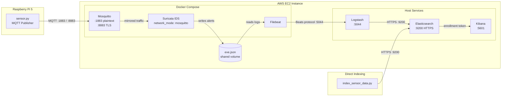

# MQTT IDS Pipeline with Suricata + ELK Stack

An intrusion detection and sensor monitoring pipeline for MQTT traffic, deployed on AWS EC2.
A Raspberry Pi 5 publishes real or simulated sensor readings over MQTT. Suricata inspects the traffic for malicious patterns while the full ELK stack (Elasticsearch, Logstash, Kibana) stores, processes, and visualizes both IDS alerts and sensor data.

## Architecture



## Data Flow

There are **two parallel data paths** into Elasticsearch:

### Path 1 — IDS Alert Pipeline

```
Pi (sensor.py) → MQTT :1883/:8883 → Mosquitto → Suricata (inspects traffic)
  → eve.json → Filebeat → Logstash :5044 → Elasticsearch → Kibana
```

- **Suricata** shares Mosquitto's network namespace and inspects all MQTT packets on `eth0`.
- **Filebeat** tails `eve.json` from a shared Docker volume and forwards to Logstash.
- **Logstash** processes and ships events to Elasticsearch over HTTPS.
- Indexed as `suricata-alerts-*` or `filebeat-*`.

### Path 2 — Sensor Data Direct Indexing

```
index_sensor_data.py → HTTPS :9200 → Elasticsearch → Kibana
```

- Suricata sees MQTT as network flow (not decoded payload), so `index_sensor_data.py` indexes structured sensor readings directly into Elasticsearch.
- Indexed as `iot-sensor-data-YYYY.MM.DD`.

## Project Structure

```text
.
├── .env                            # Credentials (not committed)
├── docker-compose.yml              # Mosquitto + Suricata + Filebeat
├── mosquitto/
│   └── config/mosquitto.conf       # Plaintext :1883 + TLS :8883
├── certs/                          # TLS certs (CA, broker, client)
├── suricata/
│   └── rules/
│       ├── local.rules             # Custom payload detection
│       ├── mqtt-rate-limit.rules   # MQTT flood detection
│       └── mqtt-malformed-json.rules # Malformed JSON detection
├── filebeat/
│   └── filebeat.yml                # Filebeat → Logstash output
└── iot-lab5/
    ├── sensor.py                   # Pi MQTT publisher (real/simulated)
    ├── index_sensor_data.py        # Direct Elasticsearch indexer
    ├── mqtt_publish_tls.py         # TLS MQTT publisher test
    ├── mqtt_flood.py               # MQTT flood attack simulation
    └── mqtt_malformed.py           # Malformed payload simulation
```

## Services

| Service | Type | Port | Role |
|---------|------|------|------|
| **Mosquitto** | Docker | 1883, 8883 | MQTT broker (plaintext + TLS) |
| **Suricata** | Docker | — | IDS, shares Mosquitto network |
| **Filebeat** | Docker | — | Ships eve.json to Logstash |
| **Logstash** | Host | 5044 | Log pipeline to Elasticsearch |
| **Elasticsearch** | Host | 9200 | Alert + sensor data storage (HTTPS) |
| **Kibana** | Host | 5601 | Visualization and dashboards |

## Detection Rules

| SID | File | Description |
|-----|------|-------------|
| 1000001 | `local.rules` | Long repeated `AAA...` payload pattern |
| 1000002 | `local.rules` | `rm -rf` string in MQTT traffic |
| 2000001 | `mqtt-rate-limit.rules` | MQTT excessive publish rate — flood/DoS (>100 msgs/60s) |
| 2000002 | `mqtt-malformed-json.rules` | MQTT payload contains `undefined` — malformed JSON indicator |
| 2000003 | `mqtt-malformed-json.rules` | MQTT oversized repeated-byte payload — buffer overflow probe |

## AWS Security Group Configuration

Open the required inbound ports on your EC2 instance security group:

1. Go to **AWS Console → EC2 → Instances** → select your instance
2. Click the **Security** tab → click the **Security Group** link
3. Click **Edit inbound rules → Add rule** for each port below:

| Port | Protocol | Source | Purpose |
|------|----------|--------|---------|
| 22 | TCP | My IP | SSH access |
| 1883 | TCP | 0.0.0.0/0 | MQTT plaintext (Mosquitto) |
| 8883 | TCP | 0.0.0.0/0 | MQTT TLS (Raspberry Pi) |
| 5601 | TCP | My IP | Kibana UI |
| 9200 | TCP | My IP | Elasticsearch API (optional, for direct access) |

4. Click **Save rules**

> **Note:** If your network blocks non-standard ports (e.g. school/corporate WiFi), access Kibana from a mobile hotspot or use a reverse proxy on port 443/80.

## Prerequisites

- Docker Engine + Compose plugin
- Elasticsearch 8.x running on the host (`https://localhost:9200`)
- Kibana 8.x running on the host (`:5601`)
- Logstash on the host (`:5044`)
- Credentials stored in `.env` (never hardcode passwords)

## Setup

### 1) Load environment variables

```bash
set -a; source .env; set +a
```

### 2) Start Docker stack

```bash
docker compose up -d
docker compose ps
```

### 3) Verify Elasticsearch

```bash
curl -sk -u "elastic:${ELASTIC_PASSWORD}" "https://localhost:9200/_cluster/health?pretty"
```

## Kibana Setup

Kibana connects to Elasticsearch via an enrollment token.

### 1) Fix Elasticsearch publish host

Elasticsearch may advertise a Docker bridge IP not in the TLS cert SANs. Add to `/etc/elasticsearch/elasticsearch.yml`:

```yaml
http.publish_host: localhost
```

```bash
sudo systemctl restart elasticsearch
```

### 2) Generate enrollment token and configure Kibana

```bash
sudo /usr/share/elasticsearch/bin/elasticsearch-create-enrollment-token -s kibana --url https://localhost:9200
sudo /usr/share/kibana/bin/kibana-setup --enrollment-token <TOKEN>
```

### 3) Bind Kibana to all interfaces

In `/etc/kibana/kibana.yml`:

```yaml
server.host: "0.0.0.0"
```

### 4) Restart and verify

```bash
sudo systemctl restart kibana
curl -s http://localhost:5601/api/status | python3 -m json.tool
```

Expected: `"level": "available"`. Access at `http://<EC2_PUBLIC_IP>:5601`.

## Publishing Sensor Data

Run the MQTT publisher from the Raspberry Pi (or EC2 for simulation):

```bash
python3 iot-lab5/sensor.py
```

This sends 30 readings to `iot/sensor/temperature` on port 1883. Suricata inspects the traffic in real time.

## Indexing Sensor Data into Elasticsearch

`index_sensor_data.py` loads credentials from `.env` automatically. No hardcoded passwords.

```bash
python3 iot-lab5/index_sensor_data.py
```

Verify:

```bash
curl -sk -u "elastic:${ELASTIC_PASSWORD}" "https://localhost:9200/iot-sensor-data-*/_count" | python3 -m json.tool
```

Expected: `"count": 30`.

## Kibana Data Views

Create data views in **Stack Management → Data Views**:

| Name | Index Pattern | Timestamp Field |
|------|--------------|-----------------|
| Suricata Alerts | `suricata-alerts-*` | `@timestamp` |
| IoT Sensor Data | `iot-sensor-data-*` | `@timestamp` |

## Attack Simulations

```bash
# Malformed JSON payload (triggers Suricata alert)
python3 iot-lab5/mqtt_malformed.py

# MQTT flood (triggers rate-limit rule)
python3 iot-lab5/mqtt_flood.py

# TLS encrypted publish (port 8883)
python3 iot-lab5/mqtt_publish_tls.py

# Manual trigger
mosquitto_pub -h localhost -p 1883 -t test/topic -m 'rm -rf /tmp'
```

## Verifying Alerts

```bash
# Suricata logs
docker compose logs suricata --tail=100

# Filebeat logs
docker compose logs filebeat --tail=100

# Elasticsearch alert indices
curl -sk -u "elastic:${ELASTIC_PASSWORD}" "https://localhost:9200/_cat/indices/suricata-alerts-*?v"
```

## Useful Commands

| Action | Command |
|--------|---------|
| Start stack | `docker compose up -d` |
| Stop stack | `docker compose down` |
| Restart stack | `docker compose restart` |
| Follow logs | `docker compose logs -f` |
| Reload env | `set -a; source .env; set +a` |
| Kibana status | `curl -s http://localhost:5601/api/status` |
| ES cluster health | `curl -sk -u "elastic:${ELASTIC_PASSWORD}" "https://localhost:9200/_cluster/health?pretty"` |

## Troubleshooting

- **Filebeat auth failure** — Ensure `ELASTIC_PASSWORD` is exported before `docker compose up`.
- **No alerts in Elasticsearch** — Verify traffic hits port 1883 and matches a Suricata rule.
- **Elasticsearch unreachable** — Confirm HTTPS on `localhost:9200` and `host.docker.internal` resolves inside Docker.
- **Kibana unavailable** — Check `server.host: "0.0.0.0"` in kibana.yml and that the enrollment token used `--url https://localhost:9200`.
- **Enrollment token SAN mismatch** — Add `http.publish_host: localhost` to elasticsearch.yml and restart.